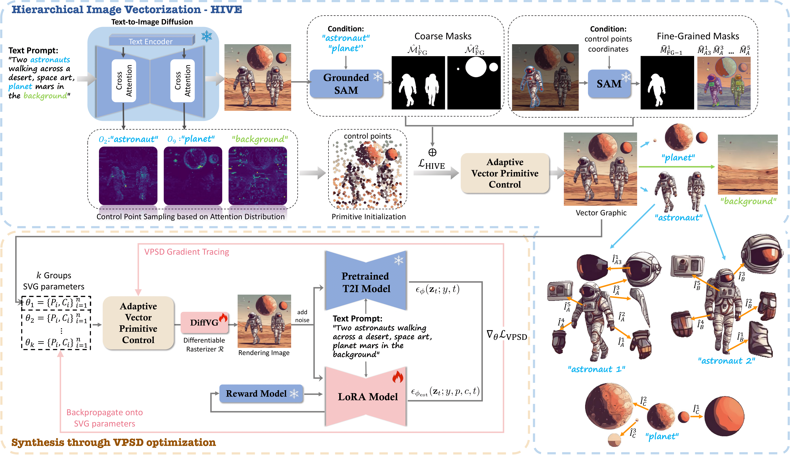
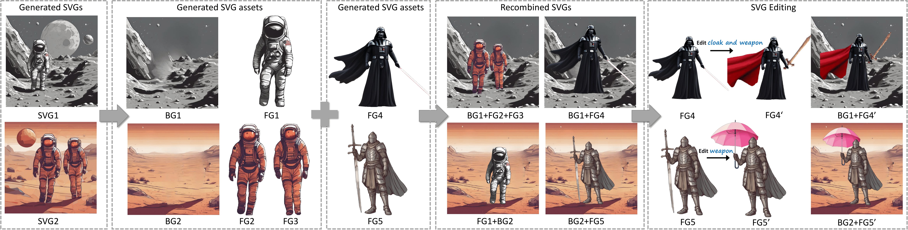

# SVGDreamer++: Advancing Editability and Diversity in Text-Guided SVG Generation

Official implementation for "SVGDreamer++: Advancing Editability and Diversity in Text-Guided SVG Generation"

## 🚀 Stay Tuned: Code Release Coming Soon

<figure>
  
  <figcaption>Fig 1. Overview of SVGDreamer++. Our method consists of two phases: Hierarchical image vectorization (HIVE) and optimized synthesis of diverse SVGs via VPSD.</figcaption>
</figure>

<figure>
  
  <figcaption>Fig 2. The editability of SVGDreamer++ results.</figcaption>
</figure>

<figure>
  
  <figcaption>Fig 3. SVG diversity generated by SVGDreamer++.</figcaption>
</figure>
